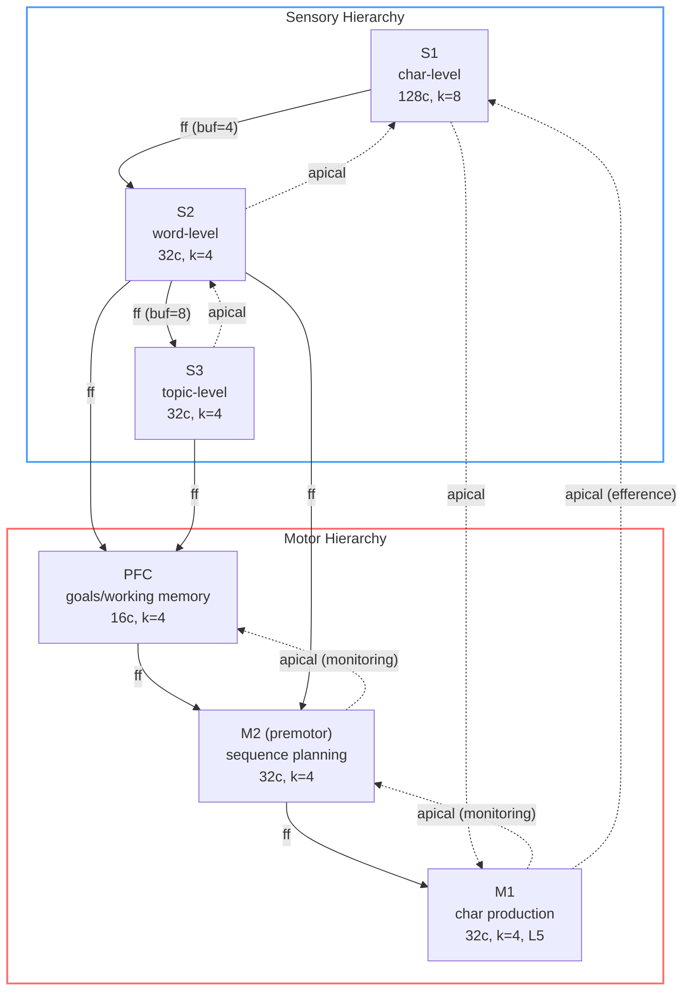

# STEP — Sparse Temporal Eligibility Propagation

A research project exploring biologically-plausible language learning using cortical minicolumn architecture. No backpropagation — learning uses local Hebbian rules, eligibility traces, and reward-modulated plasticity (three-factor learning).

## Why this approach matters

Modern LLMs use a single dense architecture where the same weights both comprehend and produce language, optimized end-to-end by a single global loss. This works at scale but creates fundamental limitations: no internal planning (requiring CoT hacks), no persistent goals (requiring prompt engineering), and opaque representations (requiring separate interpretability research).

STEP explores a different path — separated sensory and motor hierarchies with biologically grounded learning rules. This architecture offers:

**Compute efficiency.** Sparse codes (8 active columns out of 128) mean ~16x fewer operations per step. Internal state persists in neural activation patterns, not serialized tokens — "thinking" doesn't consume output bandwidth like CoT. Maps naturally to neuromorphic hardware (Intel Loihi, IBM TrueNorth) for ~1000x energy savings.

**Continual learning.** Every input updates the model — no train/inference split. Sparse representations resist catastrophic forgetting. Checkpoints capture full state for resume. Adapts online without expensive fine-tuning. (Comes with its own safety challenges — a system that learns from every interaction needs alignment mechanisms as fundamental as the learning itself.)

**Interpretability by design.** Sparse distributed codes are inherently inspectable — you can see which columns fire, what patterns they encode, how information flows between regions. We do this throughout development: "M1 produces 'th' bigrams", "PFC holds word-level patterns." No separate interpretability research needed — auditability is structural.

**Embodiment readiness.** The sensory→motor architecture IS a control system. Adding cameras (visual S1), microphones (auditory S1), and actuators (physical M1) is architecturally natural — same minicolumns, different encoders. LLMs need extensive adapter layers to interact with the physical world.

**Sample efficiency.** Developmental learning — listening before babbling before speaking — mirrors infant acquisition and is dramatically more data-efficient for specific capabilities. English words emerge from 300k tokens of child-directed speech, not billions of tokens of internet text.

**[Long-term] Different cognition.** Separated sensory/motor systems, explicit goal maintenance (PFC), and reward-modulated learning enable a fundamentally different kind of understanding than pattern completion. The architecture can develop internal goals, maintain working memory across reasoning steps, and learn from reward signals — capabilities that are bolted onto LLMs as afterthoughts but are native here.

## What it does

STEP builds a cortical hierarchy that learns to understand and produce language through developmental stages, mirroring infant speech acquisition:

1. **Listening** — Sensory regions (S1→S2→S3) learn character, word, and topic representations. Motor pathway (M2→M1) and PFC observe passively.
2. **Babbling** — M1 produces characters autoregressively, hears itself through S1. Curiosity reward (dopamine RPE) drives exploration. Caregiver reward nudges toward real words.
3. **Echo** — PFC holds a goal ("reproduce what I heard"), M2 sequences the motor plan, M1 executes. First goal-directed behavior.
4. **Dialogue** — (in progress) Listen to utterance → PFC maintains context → M2→M1 produces response.

## Architecture



**Solid arrows** = feedforward (additive drive, content/commands). **Dashed arrows** = apical (gain modulation, context/monitoring). Multiple ff to the same target are concatenated. Feedforward flows UP sensory (S1→S2→S3), DOWN motor (PFC→M2→M1). Apical flows the reverse.

Every region is a **CorticalRegion** — same minicolumn architecture (L4/L2/3, dendritic segments, apical gain), differentiated by parameters and wiring:

| Region | Type | Key feature |
|--------|------|-------------|
| S1, S2, S3 | SensoryRegion | Local connectivity, encoding-aware receptive fields |
| PFC | PFCRegion | Slow voltage decay (working memory), global gate |
| M2 | PremotorRegion | Goal-driven temporal sequencing via lateral segments |
| M1 | MotorRegion | L5 output weights, three-factor RL, babbling |

Connection types (biologically grounded):
- **Feedforward**: Additive drive, selects specific outputs. For content/commands.
- **Apical**: Gain modulation, biases excitability. For context/attention/mode.
- **Lateral**: Dendritic segments for temporal prediction within a layer.
- **Surprise**: Burst rate modulates downstream learning rate.

## Quick start

```bash
uv sync  # Python 3.12+, requires uv

# Stage 1: Sensory learning + motor pathway listening (300k tokens)
uv run experiments/scripts/chat/train.py --stage sensory --tokens 300000

# Stage 2: Interleaved listening + babbling (100k babble steps)
uv run experiments/scripts/chat/train.py --stage babbling --tokens 100000

# Interactive REPL
uv run experiments/scripts/chat/repl.py --checkpoint stage2_babbling --dataset babylm
```

## REPL commands

```
/help            Show available commands
/info            Model capabilities, vocabulary, sample prompts
/babble [N]      Watch M1 babble N chars in real time (default 200)
/probe           Show S1/S2/S3/M1 representation quality
/stats           BPC statistics
/warmup [N]      Train on N more corpus chars
/save [name]     Save checkpoint
/load [name]     Load checkpoint
/reset           Clear working memory
/quit            Exit
```

Type text to feed through the hierarchy. After your input, M1 gets a turn to speak.

## Project structure

```
src/step/
├── cortex/
│   ├── region.py       # Base CorticalRegion (L4/L2/3, segments, apical)
│   ├── sensory.py      # SensoryRegion (local connectivity)
│   ├── premotor.py     # PremotorRegion (M2, temporal sequencing)
│   ├── motor.py        # MotorRegion (M1, L5 output, three-factor, babbling)
│   ├── pfc.py          # PFCRegion (slow decay, global gate, confidence)
│   ├── circuit.py      # Region wiring, pure process() neural computation
│   ├── stages.py       # Training stage definitions
│   ├── reward.py       # CuriosityReward, CaregiverReward, EchoReward
│   ├── basal_ganglia.py # Go/no-go gating with three-factor plasticity
│   └── modulators.py   # Surprise, reward, thalamic gate
├── harness/
│   └── chat/
│       └── train.py    # ChatTrainHarness (env + agent + probes + reporter)
├── probes/
│   ├── core.py         # Probe protocol, LaminaProbe (L4/L2/3 KPIs)
│   └── chat.py         # ChatLaminaProbe (linear probe, ctx disc), ChatMotorProbe
├── snapshots/
│   ├── core.py         # L4Snapshot, L23Snapshot, LaminaRegionSnapshot
│   └── chat.py         # ChatL23Snapshot, MotorRegionSnapshot
├── reporting/
│   └── chat.py         # ChatReporter (periodic log lines from probes)
├── agent/
│   └── chat.py         # ChatAgent (encode, process, decode, reset)
├── encoders/
│   └── positional.py   # Positional character encoder
├── config.py           # Region configs and factory functions
└── data.py             # BabyLM, TinyDialogues, PersonaChat loaders

experiments/scripts/
└── chat/               # Chat modality experiments
    ├── train.py        # Staged training (sensory → babbling → echo)
    ├── repl.py         # Interactive REPL with PFC goal drive
    └── sweep_s1.py     # S1 parameter sweeps
```

## Development

```bash
uv run python -m pytest tests/ -v   # 369 tests
uv run ruff check src/ tests/       # lint
uv run ty check src/step/           # typecheck
```

## Key results

- **Sensory learning**: Centroid BPC 4.59 at 300k tokens (random baseline 5.0). Non-learned probe confirms monotonic improvement.
- **Motor babbling**: All 32 BabyLM chars discovered through curiosity-driven RL (dopamine RPE).
- **English words from babbling**: "the", "mom", "ask", "him", "not", "has" emerge from interleaved listen+babble training. 25 distinct English bigrams.
- **Echo mode**: PFC→M2→M1 pathway achieves 11.2% character match (3.7x above chance) on word reproduction. M2 outperforms PFC→M1 direct (9% ceiling).
- **Architectural insight**: Apical connections bias/modulate; feedforward connections command. Both are needed — apical for attention/mode, feedforward for content. This matches biology: PFC→premotor is feedforward, sensory feedback is apical.
